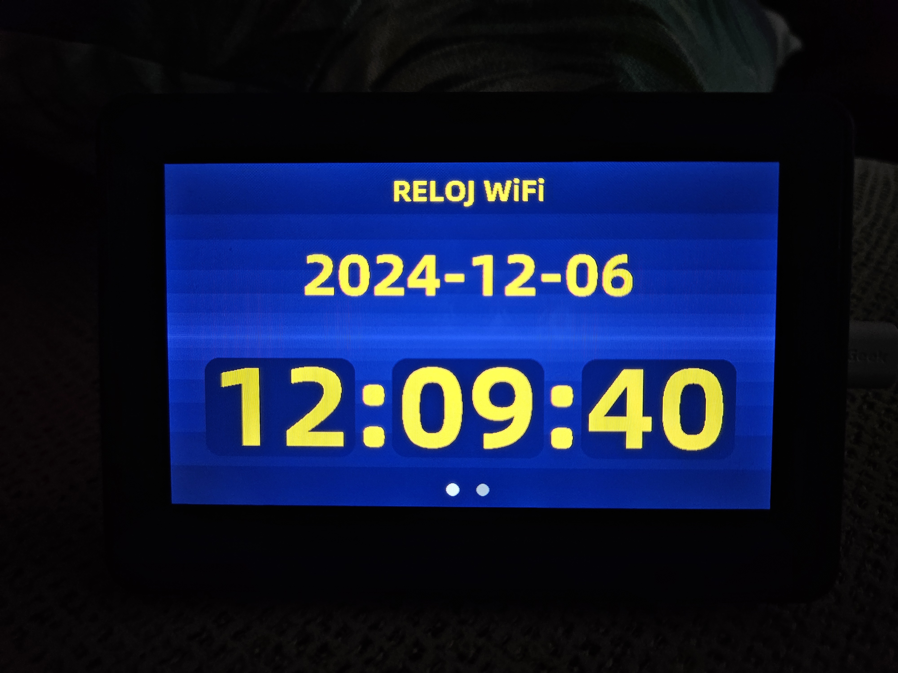
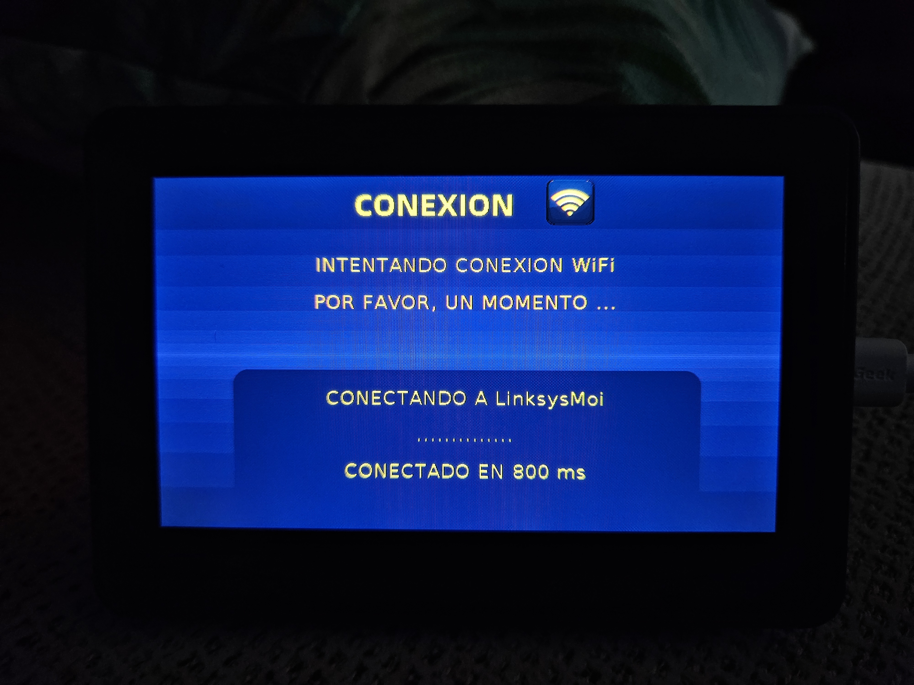
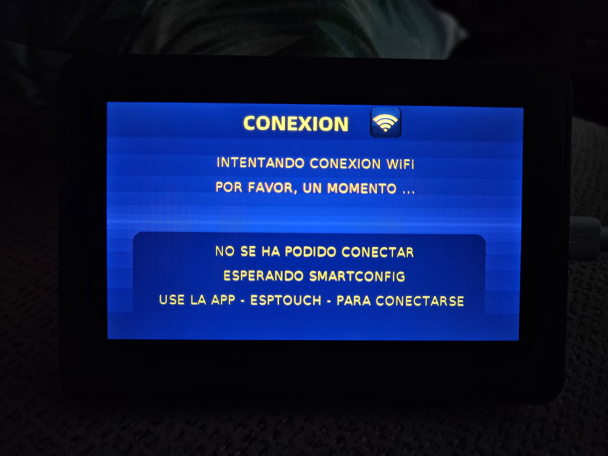

# Waveshare Esp32-s3-touch-lcd-4.3b

Este repositorio pretende ser un estudio/juego de la librería 
[LovyanGFX](https://github.com/lovyan03/LovyanGFX) con el framework Arduino en un esp32-s3-touch-lcd-4.3b.

Casi toda la información la encuentro en este gran canal [Volos Projects](https://www.youtube.com/c/VolosProjects) y adapto los proyectos a mi gusto.

## Primeros pasos

- [x] Puesta en marcha de la librería lovyangfx
- [x] Fuentes personalizadas
- [x] Usar FreeRTOS 
- [x] Gestos en la pantalla táctil

## Tab_00 Configurar Conexión
- [x] Configurar la conexión WiFi con SmartConfig 

## Tab_01 Reloj WiFi
- [x] Usar el RTC interno del ESP32
- [x] Sincronizar el reloj periodicamente 

## Tab_02 Estación Meteorológica
Añadiré datos meteorológicos siguiendo este tutorial de [Randomnerd](https://randomnerdtutorials.com/esp32-cyd-lvgl-weather-station/)

- [ ] Obtener la previsión meteorológica 
- [ ] Mostrar los datos obtenidos en Tab_02 
- [ ] Sincronizar la previsión periodicamente 

## Resultado Reloj WiFi y Conexión

<!--  -->
<!--  -->

|  |  |  |
|---------------------------------|---------------------------------|---------------------------------|

