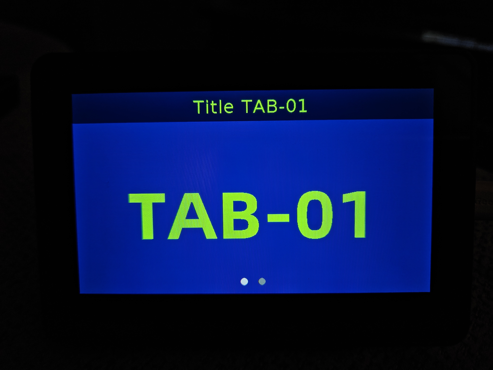

# Waveshare Esp32-s3-touch-lcd-4.3b

Este repositorio pretende ser un estudio/juego de la librería 
[LovyanGFX](https://github.com/lovyan03/LovyanGFX) con el framework Arduino en un esp32-s3-touch-lcd-4.3b.

Casi toda la información la encuentro en este gran canal [Volos Projects](https://www.youtube.com/c/VolosProjects) y adapto los proyectos a mi gusto.

## Primeros pasos

- [x] Puesta en marcha de la librería lovyangfx
- [x] Fuentes personalizadas
- [x] Usar FreeRTOS 
- [x] Gestos en la pantalla táctil

## Reloj WiFi
- [ ] Configurar WiFi con SmartConfig 
- [ ] Usar el RTC interno del ESP32
- [ ] Sincronizar el reloj periodicamente 

## Resultado

